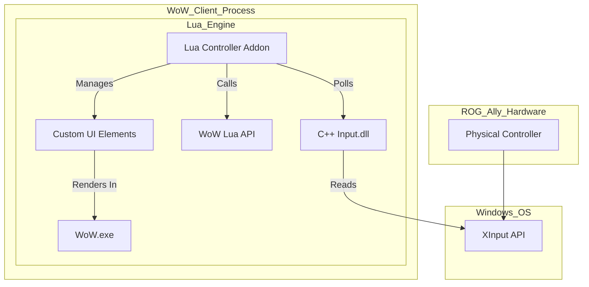

# System Patterns: WoW 3.3.5a ROG Ally Controller Enhancement

## 1. Core Architecture: Hybrid DLL + Lua Addon

The system employs a hybrid architecture to achieve deep controller integration:

*   **Input DLL (C++):**
    *   **Responsibility:** Directly interfaces with Windows XInput API to capture raw controller state (buttons, triggers, analog sticks) for the ROG Ally's controller.
    *   **Functionality:** Exposes a clean, well-defined API that can be called from the Lua environment within WoW.
    *   **Loading:** Injected into the `WoW.exe` process at startup as part of the enhanced client package.
    *   **Output:** Provides controller state data to the Lua addon upon request.

*   **Controller Logic & UI Addon (Lua):**
    *   **Responsibility:** Manages all controller-driven UI, game logic, action binding, and user configuration.
    *   **Input Source:** Polls the Input DLL for controller state changes.
    *   **UI Implementation:** Replaces or augments default WoW UI elements with controller-friendly versions. Implements the Cross Hotbar (XHB), redesigned game windows (Inventory, Character, Spellbook, etc.), and the custom "Controller Setup" screen.
    *   **Action Execution:** Translates interpreted controller inputs into WoW API calls (e.g., `CastSpellByName`, `UseAction`, `TargetUnit`).
    *   **Configuration:** Stores user-defined controller bindings and UI preferences within WoW's SavedVariables.

## 2. Key Design Patterns & UI Paradigms

*   **Cross Hotbar (XHB) System:**
    *   **Pattern:** Inspired by FFXIV. Uses Left/Right Triggers as modifiers for face buttons and D-pad, allowing quick access to ~16 actions per hotbar set.
    *   **Benefit:** Proven, efficient method for controller access to a large number of abilities in MMOs.

*   **Centralized System Menu:**
    *   **Pattern:** A common pattern in console games/applications. Accessed via a dedicated button (e.g., Start).
    *   **Benefit:** Provides a single, consistent entry point for all major game systems and configuration options.

*   **Contextual Interaction Prompts:**
    *   **Pattern:** Displays a clear visual prompt (e.g., "A: Interact") when the player is near an interactable object or NPC.
    *   **Benefit:** Simplifies interaction and reduces the need for precise cursor targeting with a controller.

*   **Tabbed Navigation for Complex Windows:**
    *   **Pattern:** Using Left/Right Bumpers (LB/RB) to switch between tabs within complex UI windows (e.g., Character Sheet, Spellbook).
    *   **Benefit:** Organizes large amounts of information and makes it easily navigable with a controller.

*   **Visual Controller Configuration:**
    *   **Pattern:** Displaying a graphical representation of the controller in the binding UI, allowing users to select a button and then assign an action to it from a list.
    *   **Benefit:** Makes the binding process highly intuitive and entirely achievable with a controller.

*   **State Management (Lua Addon):**
    *   The Lua addon will need to manage various states, such as current XHB set, active UI window, targeting mode, etc., to ensure consistent behavior.

## 3. Data Flow

1.  **Player** interacts with ROG Ally controller.
2.  **XInput** (Windows API) captures physical input.
3.  **Input DLL** (C++) reads XInput data.
4.  **Lua Addon** polls the Input DLL for the current controller state.
5.  **Lua Addon** interprets the controller state based on user configuration (bindings, active XHB set, current UI context).
6.  **Lua Addon** executes appropriate WoW API functions (cast spell, open window, target NPC, etc.).
7.  **Lua Addon** updates its custom UI elements (XHB display, window content) based on game state and controller input.
8.  **WoW Client** renders the game world and UI, reflecting the actions taken.

## 4. Component Relationships



## 5. DLL-Lua Communication API

The communication between the C++ Input DLL and the Lua Controller Addon is crucial for the system's operation. The DLL will expose a set of CFunctions that the Lua addon can call to retrieve controller status and potentially send commands (like vibration).

### 5.1. Communication Mechanism

*   **Method:** Lua CFunctions exposed by the DLL.
*   **Namespace:** Functions will be registered under a unique Lua global table (e.g., `AllyControllerLib`) to avoid naming conflicts.
*   **Polling:** The Lua addon will typically call `GetControllerState()` on every `OnUpdate` frame to get the latest input.

### 5.2. Core API Functions

The following functions will be exposed by the DLL and callable from Lua:

1.  **`IsControllerConnected()`**
    *   **Lua Call Example:** `local connected = AllyControllerLib.IsControllerConnected()`
    *   **Returns:** `boolean` - `true` if a compatible XInput controller is detected and active, `false` otherwise.
    *   **Purpose:** Allows the Lua addon to gracefully handle controller disconnections or absence.

2.  **`GetControllerState()`**
    *   **Lua Call Example:** `local state = AllyControllerLib.GetControllerState()`
    *   **Returns:** A `table` containing the comprehensive state of the controller, or `nil` if no controller is connected or an error occurs.
    *   **Structure of the returned table (if connected):**
        ```lua
        {
            isConnected = true,         -- boolean, always true if table is returned

            -- Digital Buttons (true if pressed, false if released)
            dpadUp = false,
            dpadDown = false,
            dpadLeft = false,
            dpadRight = false,
            startButton = false,
            backButton = false,
            leftStickButton = false,    -- L3
            rightStickButton = false,   -- R3
            leftShoulder = false,       -- LB
            rightShoulder = false,      -- RB
            aButton = false,
            bButton = false,
            xButton = false,
            yButton = false,

            -- Analog Triggers (0.0 to 1.0)
            leftTrigger = 0.0,
            rightTrigger = 0.0,

            -- Analog Sticks (-1.0 to 1.0 for each axis)
            leftStick = {
                x = 0.0, -- Left = -1.0, Right = 1.0
                y = 0.0  -- Down = -1.0, Up = 1.0 (WoW UI often uses Y up positive, adjust if needed)
            },
            rightStick = {
                x = 0.0,
                y = 0.0
            }
        }
        ```
    *   **Normalization:** The DLL is responsible for normalizing analog trigger values (0-255 from XInput) to a 0.0-1.0 float range, and analog stick values (e.g., -32768 to 32767 from XInput) to a -1.0 to 1.0 float range.
    *   **Deadzone Processing:** The DLL will also apply a default inner deadzone (e.g., 20%) to analog stick inputs. Values within this deadzone will be reported as 0.0 to Lua. This ensures that minor stick drift does not result in unwanted input.

3.  **`SetControllerVibration(leftMotorPercent, rightMotorPercent)`** (Optional, for later phases)
    *   **Lua Call Example:** `AllyControllerLib.SetControllerVibration(0.5, 0.75)`
    *   **Arguments:**
        *   `leftMotorPercent`: `number` (0.0 to 1.0) - Speed of the left (low-frequency, heavy) motor.
        *   `rightMotorPercent`: `number` (0.0 to 1.0) - Speed of the right (high-frequency, light) motor.
    *   **Purpose:** Allows the Lua addon to trigger haptic feedback for events like taking damage, successful interrupts, etc.

### 5.3. Error Handling

*   If `GetControllerState()` is called and no controller is connected, it should ideally return `nil` or a table with `isConnected = false`.
*   The DLL functions should be robust and avoid causing errors in Lua if unexpected situations occur (e.g., sudden controller disconnect during a call). 